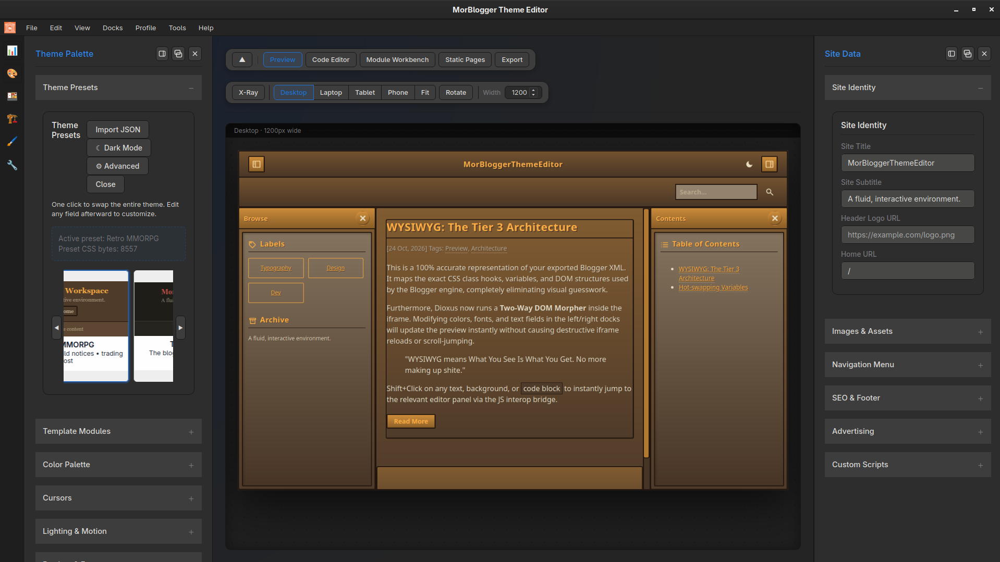

<div align="center">

# 🏛️ MorWebsite Editor

A visual editor for regular, hand-rolled websites.<br>
Open a local website folder (HTML/PHP/CSS/JS), edit design tokens visually in a Rust-powered desktop app, watch your actual site update live, then export a clean standalone `mor-theme.css` — no build pipeline required.

[](LICENSE)
[](https://www.rust-lang.org/)
[](https://dioxuslabs.com/)
[](CONTRIBUTING.md)



</div>


---

# The Problem

Plenty of good websites are hand-rolled: a folder of HTML, PHP, CSS, and JS (maybe a web-component site), no bundler, no framework, no design-token pipeline. Restyling one means grepping for hex codes across a dozen stylesheets, editing, reloading, and hoping nothing drifted.

## ✨ The Solution

MorWebsite Editor gives those sites the visual theming workflow that framework projects take for granted:

1. **Open your site folder.** The editor serves it locally — `php -S` when PHP is installed, a built-in static server otherwise.
2. **Edit design tokens visually** — colors, typography, buttons, backgrounds, cursors, scrollbars, effects — in dockable panels, or hot-swap a preset from `theme_presets/*.toml`.
3. **See your real site live.** The generated stylesheet is injected into the preview as a `<style id="mor-true-css">` block and morphed in place as you edit — no destructive reloads, no scroll-jumping.
4. **Export.** The engine compiles everything into a single standalone `mor-theme.css` dropped into your project, or a full-site ZIP bundle.

Your site's own files stay the source of truth; the editor layers a token system on top and writes plain CSS back out.


---

## 🚀 Core Capabilities

### 🎨 Token-Driven Theming
* **Theme palette docks:** Visual panels for colors, typography, buttons, backgrounds, cursors, scrollbars, and effects — every control writes to the same `ThemeConfig`.
* **Presets:** Load, tweak, and save complete looks as `theme_presets/*.toml`. Swap the whole skin in one click.
* **Clean CSS assembly:** `build_master_css` + `render_css_sockets` stitch your tokens and modular CSS into a single `mor-theme.css` (see [CSS Pipeline](docs/CSS_PIPELINE.md)).

### 🖥️ Your Real Site, Live
* **Local preview server:** Your project folder is served as-is — `php -S` when PHP is available, a built-in static server otherwise. PHP sites render as PHP, not as source dumps.
* **Live injection:** The generated stylesheet rides in a `<style id="mor-true-css">` block and is morphed in place as you edit — no iframe reloads.
* **CSS/JS editors on real files:** CodeMirror editors and the CSS/JS builders operate on your site's actual stylesheets and scripts.
* **Static page stencils:** Generate standalone HTML page scaffolds that pick up the active theme.

### 🩺 Website-Flavored Diagnostics
* **Unresolved tokens:** Theme variables referenced but never defined.
* **Selector drift:** Theme rules targeting selectors your site no longer contains.
* **Unlinked stylesheets:** CSS files in the project that no page actually loads.

### 🎁 Linux Desktop Integration (GTK Import)
* **Match your desktop:** Import color schemes and visual styles from GTK3/GTK4 themes like Adwaita, Nord, or WhiteSur.
* **Built-in graphics:** Bundled SVGs are converted to data URIs and embedded straight into the theme — no extra HTTP requests.

### 🧰 Extensibility
* **Plugin manager:** Install workspace plugins in-app or via `mwt plugin install`.
* **Opt-in MCP/AI bridge:** Connect an external MCP engine when you want it; fully offline otherwise.

### 🪟 The Visual Workspace
* **Lightweight interface:** Built on Dioxus 0.7 — a fast, native desktop shell.
* **Dockable everything:** Pinnable activity bar, floating panels, flexible dock zones.
* **Adaptive window chrome:** Borders adapt to Windows, macOS, and keyboard-only Linux setups.


---

## 🎨 How to Import Native GTK4 Linux Themes

MorWebsite Editor can steal colors, borders, and UI icons directly from native Linux GTK desktop themes and convert them into design tokens.

See also: [GTK Theme Parsing](docs/GTK_PARSER.md)

1. Go to [GNOME-Look.org](https://www.gnome-look.org/browse/).
2. Download any GTK3/GTK4 theme archive (e.g., `Mojave-Dark-alt.tar.xz`).
3. Extract the archive on your computer.
4. Open MorWebsite Editor and click **Import GTK4 Theme**.
5. Select the **top-level extracted folder** (the folder that contains `gtk-4.0`, `gnome-shell`, etc.).
6. The engine will absorb the CSS and SVG data URIs. Click **Save Imported Theme as Preset** to keep it.


---

# 🛠️ Getting Started

MorWebsite Editor is a Rust-powered desktop app for visually theming local websites and exporting a standalone `mor-theme.css`.

## Prerequisites

### 1. Install Rust

Install the Rust toolchain from:

- https://rustup.rs/

Verify installation:

```bash
rustc --version
cargo --version
```

### 2. Optional: PHP

If your site uses PHP, install it so the live preview can serve pages through `php -S`. Without PHP, the built-in static server is used instead.

---

## Option A: Launch the Visual Editor

```bash
cargo run -p mor_website_dioxus_ui
```

This opens the **native desktop window** (Dioxus desktop target — not a browser tab). For hot-reloading during development, install the Dioxus CLI (`cargo install dioxus-cli`) and run `dx serve` from `mor_website_dioxus_ui/`.

In the app: open your website folder, edit tokens in the dock panels, watch the live preview, and export `mor-theme.css` when you're happy.

---

## Option B: Use the Command-Line Tool (mwt)

Build the release executable:

```bash
cargo build --release -p mor_website_cli
```

The binary will be located at `target/release/mwt`.

```bash
# Initialize a MorWebsite workspace.toml in your website project
mwt init

# Or scaffold a full modular PHP starter (Site Contract + edit markers)
mwt init --template starter ./my-site

# Validate the theme: unresolved tokens, selector drift, unlinked stylesheets
mwt check --project .

# Compile tokens + modular CSS into mor-theme.css
mwt build --project .

# Package the themed site as a ZIP bundle
mwt bundle --project .

# Install a workspace plugin
mwt plugin install <path>
```

---

## Typical Development Workflow

```bash
# 1. Create or open a workspace
mwt init

# 2. Edit visually
cargo run -p mor_website_dioxus_ui

# 3. Validate
mwt check

# 4. Build mor-theme.css
mwt build

# 5. Package for distribution
mwt bundle
```

---

## Troubleshooting

### Build Failures

Update Rust:

```bash
rustup update
```

Clean and rebuild:

```bash
cargo clean
cargo build
```

### Theme Doesn't Apply

Run `mwt check` — the diagnostics will flag unresolved tokens and stylesheets your pages never link.


---

## Architecture: Bring Your Own Frontend (BYOF)

MorWebsite Editor splits the software into a reusable **Socket** (window chrome, docks, activity bar) and a swappable **Plug** (website-specific preview, export, and project views). The theme engine stays in `mor_website_core`; both the Dioxus UI and `mwt` CLI call into it.

### The Three Main Pieces

* **1. The Engine (`mor_website_core`):** Headless logic — reads settings and presets, builds the master CSS, runs diagnostics. No buttons or windows.
* **2. The Visual Workspace (`mor_website_dioxus_ui`):** The desktop UI you click on. Socket-and-plug layout:
  * **Socket (`MorLayoutChrome`):** Main window, dock zones, activity bar, floating panels.
  * **Plug (`WebsiteWorkspace`):** Live site preview, theme export, and project views. This is the same socket the sibling MorBlogger Theme Editor uses — only the plug differs.
* **3. The Command Line (`mor_website_cli` / `mwt`):** Terminal workflow for init, check, build, bundle, and plugin.

### Socket & Plug in Plain English

| Piece | What it is | Key types |
| --- | --- | --- |
| **Socket** | Generic editor shell — tabs, docks, popups | `MorLayoutChrome`, `DockZone`, `ActivityBar` |
| **Plug** | Domain brains — what you are actually editing | `WebsiteWorkspace` here; `BloggerWorkspace` in the sibling MorBlogger editor |
| **Promise** | Swap the plug, keep the socket | Fixes in website logic don't require rewriting dock chrome |

Deep dive: [Architecture Overview](docs/ARCHITECTURE.md)


---

## 🌐 Ecosystem & Lineage

MorWebsite Editor is a sibling/fork of the [MorBlogger Theme Editor](https://github.com/MoribundInstitute) — same socket-and-plug editor shell and preset system, retargeted from Blogger XML templates to regular local websites.

### Core Libraries
- [MOR UI Kit](https://github.com/MoribundInstitute/mor_rust_dioxus_ui_kit) — The standalone Dioxus UI toolkit powering the editor shell.

### Companion Plugins
Standalone tools that plug into the editor via its compiler crate (`mor_website_core`), checked out as sibling repos:
- [mor-website-editor-mcp](https://github.com/MoribundMurdoch/mor-website-editor-mcp) — the MCP engine for AI access (see *AI & LLM Integration* below).
- [mor-website-editor-ssh-publish](https://github.com/MoribundInstitute/mor-website-editor-ssh-publish) — `mor-publish`: export mor-theme.css and rsync the project to any SSH host (Hostinger defaults baked in).

### Legacy Lineage
The MorBlogger project maintains community compendiums (full themes, presets, widgets) built for Blogger. Its **theme presets** translate directly — MorWebsite uses the same `theme_presets/*.toml` format and `mor_` token namespace. Blogger-specific compendiums (widgets, XML structures) do not apply here.


---

## 📚 Documentation & Deep Dives

- [**Site Contract**](docs/SITE_CONTRACT.md) — Hooks, tokens, edit markers, and how to build modular sites the GUI can edit.
- [Architecture Overview](docs/ARCHITECTURE.md) — Rust theme engine, Dioxus state, docks, and ThemeSignals.
- [The CSS Assembly Pipeline](docs/CSS_PIPELINE.md) — The `mor_` namespace and how tokens become `mor-theme.css`.
- [Creating a Theme Preset](docs/THEME_CREATION.md) — Tokens, palettes, and preset authoring.
- [GTK Theme Parsing](docs/GTK_PARSER.md) — How Linux desktop themes become theme tokens.
- [Starter site](examples/mor_starter/) — Modular PHP + web component project ready to open in the editor.

Editable diagram sources live in [`docs/diagrams/`](docs/diagrams/). Some diagrams predate the fork and show the Blogger XML pipeline — treat those as legacy lineage.

## 🧰 Resources
Need assets or reference material for your theme? Use these external tools:

- **Icons:** [Google Material Symbols](https://fonts.google.com/icons) (Download as SVG, upload via the editor UI)
- **Icons:** [Lucide](https://lucide.dev/) (Clean, neutral SVG icons)
- **Asset Generation:** [halftone.tools](https://halftone.tools) (Free, browser-based print-effects workshop for retro dithered backgrounds or custom SVGs)


---

## Custom Fonts

Since you're theming your own site folder, you have two good options for typography.

### Option 1: Self-Host (Recommended)

Drop the font file (`.woff2`, `.ttf`) into your project and declare it in the **Custom CSS** panel:

```css
@font-face {
  font-family: 'Brand Serif';
  src: url('/fonts/BrandSerif-Regular.woff2') format('woff2');
  font-weight: 400;
  font-style: normal;
  font-display: swap;
}

:root {
  --font-heading: 'Brand Serif', Georgia, serif;
}
```

The rule ships inside your exported `mor-theme.css`; the font file travels with your site. No third-party requests, no tracking, no CORS surprises.

### Option 2: A Privacy-Friendly CDN

If you'd rather not manage font files, use [fonts.bunny.net](https://fonts.bunny.net) — the same catalog as Google Fonts, minus the tracking pixels and IP logging.

1. Pick your font family at [fonts.bunny.net](https://fonts.bunny.net).
2. Copy the generated `@import` rule.
3. Paste it into the **Custom CSS** panel.

```css
@import url('https://fonts.bunny.net/css?family=inter:400,700');

:root {
  --font-body: 'Inter', system-ui, sans-serif;
}
```

**A note on external hosts:** if you load fonts from a third-party server, strict CORS headers on that host can make the font silently fail and fall back to a default. Self-hosting avoids the problem entirely.

Custom font rules pass through the internal normalization pipeline (`resolve_font_stack()`) before export — see [DECISIONS.md](DECISIONS.md).


---

## 🤖 AI & LLM Integration (Strictly Opt-In)

For developers and power users who want AI assistance without embedding a runtime inside the GUI, we maintain a standalone, headless MCP (Model Context Protocol) server in a separate repo.

By running the **MorWebsite MCP Engine**, you can connect your CLI agent or desktop IDE directly to MorWebsite core: open a website project, read pages, compile `mor-theme.css` through the editor's own pipeline, run the editor's diagnostics, and write validated theme presets.

Communication between the UI and the MCP server needs no IPC at all: the editor already hot-watches its `theme_presets/` folder (`theme_hot_reload` in the Dioxus app), so a preset the AI writes through the engine restyles the live preview immediately.

### Easiest: install from the editor

1. Open **Plugin Manager** (menu → Plugin Manager).
2. Open the **Marketplace** tab.
3. Click **Install MCP AI Bridge** (downloads the OS release asset and registers Claude Desktop + daemon registry).
4. Restart Claude Desktop / your MCP client so it picks up the registered server (`mor_website_engine`).

Release assets (exact names the installer expects):

| Platform | Asset |
|---|---|
| Linux | `mor-mcp-linux` |
| Windows | `mor-mcp-windows.exe` |
| macOS | `mor-mcp-macos` |

You can also install a local plugin folder from the CLI:

```bash
mwt plugin install /path/to/plugin_dir   # needs manifest.toml + entrypoint
# or from the MCP repo:
cd ../mor-website-editor-mcp && ./install.sh
```

### Manual agent registration

```bash
claude mcp add mor -- \
  /path/to/mor-mcp \
  --presets-dir /path/to/mor_website_editor/theme_presets
```

🔗 **Get the MCP Engine:** [mor-website-editor-mcp](https://github.com/MoribundMurdoch/mor-website-editor-mcp)

*Note: This is strictly opt-in. The core MorWebsite UI is offline and local by default. The engine is a separate process launched by your MCP client; the editor only helps download/register the binary and hot-reloads presets the agent writes.*


---

## 🤝 Contributing
The Moribund Institute welcomes contributions! If you have built a beautiful, robust theme preset with MorWebsite Editor, we would love to feature it.

To leave naming space open for the community (so we don't hog generic names like "Modern Editorial" or "Web 2.0"), the Moribund Institute reserves the `mor-` prefix for our official theme releases.

Whether you are submitting a PR to share your preset publicly or just building for yourself, please ensure your internal CSS and variables follow the `mor_` namespacing guidelines outlined in the [Theme Creation Guide](docs/THEME_CREATION.md).

## Credits & Lineage

MorWebsite Editor is a sibling/fork of the **MorBlogger Theme Editor** by the Moribund Institute — same engine architecture, dock workspace, and preset system, retargeted from Blogger templates to regular local websites.

## License
Published under the MIT License.

The Moribund Institute doesn't strictly care about copyright (it's often an arbitrary barrier to the acceleration of ideas), but we do have egos, so attribution is always appreciated!

<div align="center">
  <br>
  <b>Developed by Murdoch</b><br>
  <i>The Moribund Institute</i>
</div>


